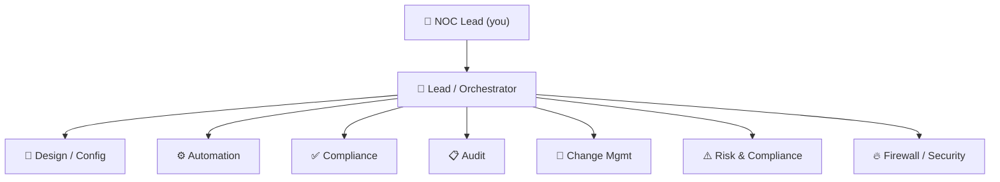

# Agent Roster — The Network Engineering Team

One agent per discipline, modeled on how a real network team is organized. Each
agent has a **single clear charter**, a **bounded toolset** (which MCP servers it
may call), and a **default autonomy tier** (defined in [`GOVERNANCE.md`](GOVERNANCE.md)).

You operate as the **NOC Lead**. The **Lead Agent** is your deputy that coordinates
the rest. Build them in the order given in [`ROADMAP.md`](ROADMAP.md) — you do not
stand up all eight at once.

---

## 🧭 Lead / Orchestrator Agent

- **Charter:** Translate operator intent into a plan, route sub-tasks to
  specialists, sequence them, and **enforce approval gates**. The only agent that
  talks to all the others.
- **Owns:** task decomposition, agent-to-agent routing, gate enforcement,
  surfacing decisions to the human.
- **Tools:** none that touch the network directly — it delegates. Reads the audit
  trail; calls other agents.
- **Default autonomy:** Tier 2 (propose plans; cannot itself execute writes).
- **Does NOT:** push config, mint credentials, or self-approve a change.

## 📐 Design / Config Agent

- **Charter:** Produce correct candidate device configurations from the source of
  truth.
- **Owns:** Jinja templates, config rendering, parameter correctness against NetBox.
  *This is a direct extension of the existing `netbox-nornir-graphql-webinar` engine.*
- **Tools:** NetBox MCP (read), Git MCP (propose), Validation MCP (syntax/model check).
- **Default autonomy:** Tier 3 in lab, Tier 2 in prod (renders + opens PR; never pushes).
- **Inputs:** intent + NetBox data → **Output:** a reviewed config diff in a PR.

## ⚙️ Automation Agent

- **Charter:** Build and maintain the *machinery* — Nornir tasks, CI pipelines,
  idempotent runbooks — and execute approved changes.
- **Owns:** the Exec MCP's playbooks, post-change verification logic, rollback
  procedures.
- **Tools:** Nornir/Exec MCP, Git MCP, Secrets Broker (short-lived creds at exec time).
- **Default autonomy:** Tier 3 in lab/staging; Tier 2 in prod (executes **only**
  after a Change Mgmt-issued, human-approved token).
- **This is the only agent that opens a session to a production device** — and only
  with an approval token.

## ✅ Compliance Agent

- **Charter:** Continuously check intended *and* actual state against policy.
- **Owns:** compliance rule sets (CIS, PCI-DSS, NIST 800-53, internal standards),
  **drift detection** between NetBox (intended) and device/telemetry (actual).
- **Tools:** Validation MCP (Batfish/CIS), NetBox MCP (read), Observability MCP (read).
- **Default autonomy:** Tier 4 — fully autonomous, because it is **read-only**. It
  raises findings; it never fixes them itself.
- **Cadence:** runs on every proposed change *and* on a schedule for drift.

## 📋 Audit Agent

- **Charter:** Turn the audit trail into auditor-ready evidence and reconcile the
  books.
- **Owns:** evidence packages, change histories, SoT-vs-actual reconciliation
  reports, attestation narratives.
- **Tools:** Audit-trail reader, NetBox MCP (read), Observability MCP (read).
- **Default autonomy:** Tier 4 — read-only, fully autonomous.
- **Distinct from Compliance:** Compliance asks *"are we within policy right now?"*;
  Audit asks *"can we prove what happened, and does it reconcile?"*

## 🔁 Change Management Agent

- **Charter:** Run the change-control process and own the approval gate mechanics.
- **Owns:** change records (ITSM), maintenance windows, change calendars/freezes,
  pre/post-check orchestration, rollback plans, and **issuing the execution token**
  once a human approves.
- **Tools:** ITSM MCP, Git MCP, Validation MCP; coordinates Automation for execution.
- **Default autonomy:** Tier 2 — it *prepares* and *gates*; the human approves; it
  then *releases* execution. It cannot approve on the human's behalf.

## ⚠️ Risk & Compliance Agent

- **Charter:** Quantify the risk of a proposed change before it reaches a human.
- **Owns:** **blast-radius analysis** (what depends on this device/link?), risk
  scoring, **segregation-of-duties** enforcement (the agent that designed a change
  cannot be the one that approves it), change-freeze awareness.
- **Tools:** Validation MCP (Batfish reachability/impact), NetBox MCP (read),
  RAG (precedent from past incidents).
- **Default autonomy:** Tier 4 (read-only analysis) — but it holds a **veto**: a
  HIGH risk score forces a mandatory human gate even for otherwise-low-tier changes.

## 🔥 Firewall / Security Agent

- **Charter:** Keep firewall rulesets clean and the security posture sound.
- **Owns:** ruleset analysis — shadowed, overly-permissive, unused, and conflicting
  rules — and security-relevant config hygiene. **Backed by the `Firewall-Analyser`
  app**, which becomes its UI and analysis backend.
- **Tools:** Firewall-Analysis MCP, NetBox MCP (read), Validation MCP.
- **Default autonomy:** Tier 4 for analysis/reporting; Tier 2 to propose rule
  changes (which then flow through the normal change path).

---

## Summary table

| Agent | Writes? | Default tier | Backed by existing asset |
|---|---|---|---|
| 🧭 Lead / Orchestrator | no (delegates) | T2 | — |
| 📐 Design / Config | proposes (PR) | T3 lab / T2 prod | `netbox-nornir-graphql-webinar` |
| ⚙️ Automation | **executes (gated)** | T3 lab / T2 prod | `netbox-nornir-graphql-webinar` |
| ✅ Compliance | no (read-only) | T4 | — |
| 📋 Audit | no (read-only) | T4 | — |
| 🔁 Change Mgmt | process + token | T2 | — |
| ⚠️ Risk & Compliance | no (read-only, **veto**) | T4 | — |
| 🔥 Firewall / Security | proposes | T4 analysis / T2 change | `Firewall-Analyser` |

> **Segregation of duties is structural, not optional.** The agent that *designs* a
> change (Config) is never the one that *approves* it (human via Change Mgmt) nor
> the one that *judges its risk* (Risk). That separation is what makes the team
> auditable.
