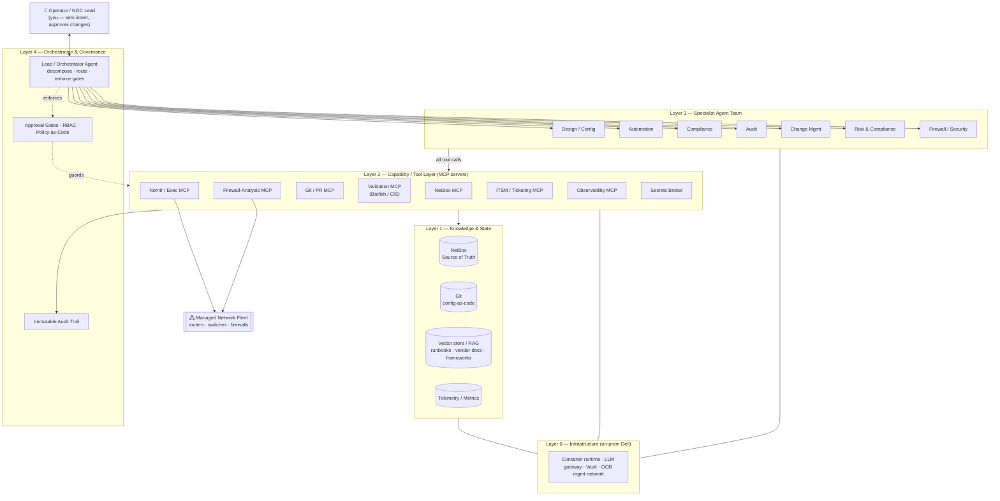
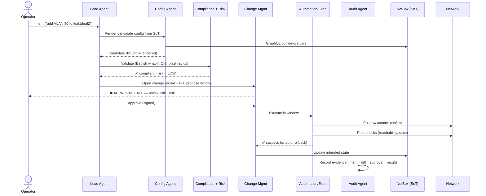
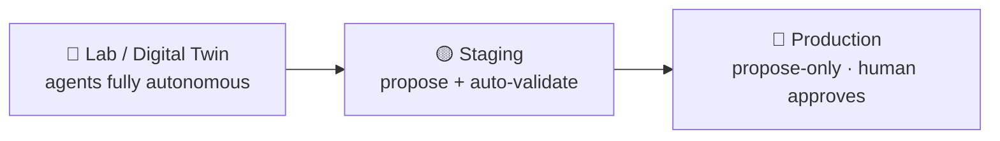

# Target Architecture — Agentic Network Engineering Platform

This document maps the **full target architecture**. It is the blueprint the rest
of the build follows. It is deliberately complete-but-static: it describes the end
state and the layers, not an implementation that exists yet.

---

## 1. The big picture

A layered platform running **on-premises on your Dell servers**. Intent flows down
from the operator through an orchestrator to a team of specialist agents; those
agents act on the network only through a governed tool layer, against a single
source of truth, and every action lands in an immutable audit trail.



---

## 2. The layers, top to bottom

### Layer 0 — Infrastructure (your Dell servers)

The whole platform runs on-prem. Nothing about the device fleet leaves your
network except, optionally, reasoning calls to the LLM provider through a single
controlled egress.

| Concern | Target |
|---|---|
| **Compute / orchestration** | Containerized (Docker Compose to start; **k3s** when you need HA across the Dell nodes). Each MCP server and each agent runtime is its own container. |
| **LLM serving** | **Hybrid.** Default reasoning to the **Claude API** through one auditable egress gateway. Optionally co-locate a local model (vLLM/Ollama on a GPU Dell) for low-risk, high-volume, or air-gapped tasks. The gateway logs every prompt/response for the audit trail. |
| **Secrets** | **HashiCorp Vault** (or SOPS for a lighter start). Agents never see long-lived device credentials — the Secrets Broker issues short-lived, scoped creds per task. |
| **Network reachability** | Agents reach devices only via the **management VRF / out-of-band network**. The exec tier is the only thing that can open a session to a device. |
| **Identity** | Every agent and MCP server has its own service identity (mTLS / SPIFFE-style) so the audit trail can attribute every call. |

### Layer 1 — Knowledge & State

The agents are stateless reasoners; all durable truth lives here.

- **NetBox — the Source of Truth (SoT).** Intended state: devices, interfaces, IPs,
  tenants, custom fields (router-id, OSPF area, etc. — exactly the data the existing
  GraphQL query already pulls). *If it's not in NetBox, it isn't real.*
- **Git — config-as-code.** Rendered configs, Jinja templates, compliance policies,
  agent definitions, runbooks. Change happens through PRs so it's reviewable and
  revertible.
- **Vector store / RAG.** Grounding knowledge: vendor docs, internal runbooks,
  compliance frameworks (CIS, PCI-DSS, NIST 800-53), and **past changes/incidents**
  so agents reason from precedent, not just first principles.
- **Telemetry / metrics (operational state).** Prometheus/Grafana or streaming
  telemetry — the *actual* state, which the Compliance and Audit agents reconcile
  against NetBox's *intended* state (drift detection).

> **Intended state (NetBox/Git) vs actual state (telemetry/device).** Half the
> platform's job is keeping these two in sync and flagging when they diverge.

### Layer 2 — Capability / Tool Layer (MCP servers)

Agents never touch infrastructure directly. Every capability is an **MCP server**
with its own auth, rate limits, dry-run mode, and audit hook. This is the
**single choke point** where governance is enforced — agents can only do what a
tool lets them.

| MCP server | Capability | Safety features |
|---|---|---|
| **NetBox MCP** | Read/write the SoT | Write-scoped per tenant; writes go through review |
| **Nornir / Exec MCP** | Push config, gather facts | **Dry-run + commit-confirm + rollback**; prod requires an approval token |
| **Git / PR MCP** | Branch, commit, open PRs | Can propose; cannot self-merge to protected branches |
| **Validation MCP** | **Batfish** model analysis, **CIS** benchmark checks, reachability/ACL diffing | Read-only; pre-change "what-if" analysis |
| **Firewall-Analysis MCP** | Parse rulesets, find shadowed/overly-permissive/unused rules | Backs the `Firewall-Analyser` app |
| **ITSM / Ticketing MCP** | Create/track change records (ServiceNow/Jira) | Source of the change-control record |
| **Observability MCP** | Query metrics/logs/alerts | Read-only |
| **Secrets Broker** | Mint short-lived device creds | Per-task, time-boxed, fully logged |

### Layer 3 — The Specialist Agent Team

One agent per discipline. Full roster, responsibilities, tools, and autonomy
levels are in **[`AGENTS.md`](AGENTS.md)**. In one line each:

- **Design / Config** — render candidate configs from NetBox via Jinja (extends the existing demo).
- **Automation** — build and maintain Nornir tasks, CI pipelines, idempotent runbooks.
- **Compliance** — check config & state against CIS/PCI/NIST and internal policy; continuous drift detection.
- **Audit** — produce evidence and reports; reconcile SoT vs actual; own the audit narrative.
- **Change Management** — turn approved designs into change records, windows, pre/post checks, rollback plans.
- **Risk & Compliance** — score risk and blast radius of proposed changes; enforce segregation of duties; sign-off.
- **Firewall / Security** — ruleset hygiene and security posture (backed by `Firewall-Analyser`).

### Layer 4 — Orchestration & Governance

- **Lead / Orchestrator Agent ("NOC Lead's deputy").** Receives operator intent,
  decomposes it, routes sub-tasks to specialists, and **enforces the approval
  gates**. This is the seat you operate from.
- **Approval gates, RBAC, policy-as-code.** Defined in
  **[`GOVERNANCE.md`](GOVERNANCE.md)**. Codifies what each agent may do, where
  humans must sign off, and the autonomy tiers.
- **Immutable audit trail.** Every intent, prompt, tool call, diff, and approval —
  append-only. This stream *is* your compliance evidence; the Audit agent reads it.

---

## 3. How a change actually flows

The canonical "make a change to production" path, showing where each agent and
gate sits. This is the loop the whole platform exists to run safely.



Key properties of this flow:

1. **Validation happens before any human is asked to approve** — the operator only
   reviews changes that already passed compliance and risk checks.
2. **The approval gate is a hard stop** for production. No agent can cross it.
3. **commit-confirm + post-checks + auto-rollback** mean a bad push reverts itself
   if reachability/state checks fail.
4. **NetBox is updated last**, so the SoT only ever reflects what actually shipped.
5. **The Audit agent is a passive observer** of the whole chain — it never needs to
   reconstruct what happened, because it watched it happen.

---

## 4. Environments & promotion

Agent autonomy scales with environment risk. Same agents, different leash.



- **Lab / digital twin** — a Batfish/containerlab model of the network where agents
  can act freely, test runbooks, and fail safely.
- **Staging** — real but non-customer-facing; agents execute with automatic
  validation but no production blast radius.
- **Production** — agents may *propose and validate* but a human crosses the gate.

---

## 5. Repository layout (target)

`Network-Automation` becomes the umbrella/monorepo; the existing repos plug in.

```
Network-Automation/
├── docs/                  # this architecture set (start here)
├── agents/                # one definition per specialist (prompt, tools, autonomy tier)
│   ├── lead/
│   ├── config/
│   ├── automation/
│   ├── compliance/
│   ├── audit/
│   ├── change-management/
│   ├── risk/
│   └── firewall/
├── mcp-servers/           # the Layer-2 tool servers
│   ├── netbox/
│   ├── exec-nornir/       # wraps the netbox-nornir-graphql engine
│   ├── validation/        # Batfish + CIS
│   ├── firewall/          # wraps Firewall-Analyser
│   └── ...
├── policies/              # policy-as-code: RBAC, autonomy tiers, compliance rules
├── runbooks/              # versioned, agent-executable runbooks
├── templates/             # Jinja config templates (from the webinar repo)
└── deploy/                # Compose / k3s manifests for the Dell servers
```

---

## 6. What this architecture explicitly defers

To keep the map honest about scope:

- **No agent has production write access on day one.** Promotion is earned via the
  autonomy tiers in `GOVERNANCE.md`.
- **Vendor/protocol specifics** (NETCONF vs SSH-CLI per platform, gNMI telemetry)
  are an implementation detail of the Exec MCP, decided per device family later.
- **Multi-site / multi-tenant scale-out** is a Phase-3 concern (see `ROADMAP.md`).

---

*Next: read [`AGENTS.md`](AGENTS.md) for the team roster, then
[`GOVERNANCE.md`](GOVERNANCE.md) before granting any write access.*
