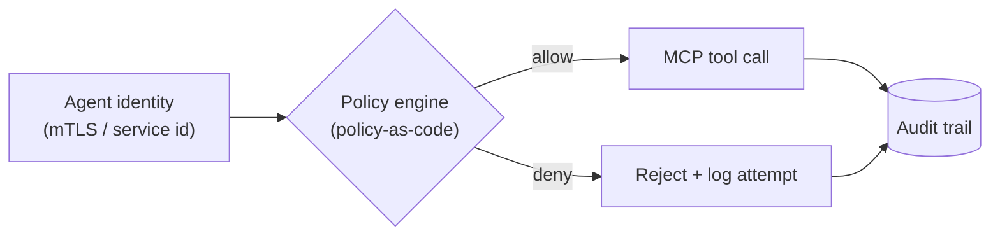

# Governance — Guardrails, Autonomy, Approvals & Audit

Read this **before granting any agent write access.** This is the layer that makes
an autonomous network team safe enough to run operations, compliance, and change
management. The architecture in [`ARCHITECTURE.md`](ARCHITECTURE.md) is only as
trustworthy as the controls here.

---

## 1. Autonomy tiers

Every agent operates at a tier, **per environment**. An agent can be Tier 4 in the
lab and Tier 2 in production simultaneously. Promotion is earned, never assumed.

| Tier | Name | The agent may… | Human involvement |
|---|---|---|---|
| **T1** | **Observe** | Read state, answer questions, report | none needed |
| **T2** | **Propose** | Produce diffs/PRs/plans; run read-only validation | **human approves before execution** |
| **T3** | **Execute (bounded)** | Apply changes **in lab/staging only**, with auto-rollback | human reviews after the fact |
| **T4** | **Autonomous (read-only domain)** | Run continuously and unattended | none — *only granted to read-only agents (Compliance, Audit, Risk)* |

> **The rule that prevents disasters:** No agent gets T3 *in production*. Production
> writes always pass a human gate (the change becomes T2-into-execution). T4 is
> reserved for agents that **cannot** write — autonomy is granted *because* they're
> read-only, not despite it.

---

## 2. RBAC — who can call what

Authorization is enforced at the **MCP / tool layer** (Layer 2), not inside the
agent prompt. A prompt can be jailbroken; a tool ACL cannot be talked around.



- Each agent has a **service identity**; each MCP server checks it against
  `policies/rbac.yaml`.
- **Default deny.** An agent can call only the tools explicitly granted to it in
  `AGENTS.md`.
- **Writes are scoped.** The NetBox MCP grants write only to specific object
  types/tenants; the Exec MCP grants execution only with a valid change token.
- **Denied attempts are logged**, not silently dropped — a pattern of denials is
  itself a signal.

---

## 3. Approval gates

A gate is a hard stop that an agent **cannot** cross alone. Gates are triggered by
policy, not by an agent's discretion.

| Trigger | Gate |
|---|---|
| Any write to **production** | Human approval (signed) via Change Mgmt |
| **Risk score = HIGH** (Risk agent veto) | Mandatory human approval, even in staging |
| Change during a **freeze window** | Blocked unless an emergency-change override is signed |
| Touching a **segregation-of-duties** boundary | Second distinct approver required |
| **Out-of-band / emergency** change | Allowed, but post-hoc review + evidence within 24h is mandatory |

Approvals are **cryptographically attributable** — the approver's identity and the
exact diff they approved are bound together in the audit trail. You can't approve
"a change" in the abstract; you approve *this* diff.

---

## 4. Segregation of duties

Structurally enforced by splitting the work across agents (see `AGENTS.md`):

- **Design ≠ Approve ≠ Judge-risk.** The Config agent designs, the Risk agent
  scores, a human approves. No single actor spans all three.
- **The Lead agent orchestrates but cannot execute** — it has no write tools.
- **The Audit agent is independent** of the agents it audits and is read-only, so
  it can't tamper with the evidence it produces.

---

## 5. Safe-execution mechanics

Even an approved change executes defensively. The Exec MCP enforces:

1. **Dry-run first** — render and diff against the live device before any write.
2. **commit-confirm** — push with an automatic revert timer; the change sticks only
   if a post-check confirms it.
3. **Post-checks** — reachability, protocol adjacency, and intended-state assertions
   run immediately after the push.
4. **Auto-rollback** — failed post-checks trigger an automatic revert; the change
   record is updated to FAILED.
5. **Short-lived credentials** — minted per-task by the Secrets Broker, scoped to
   the target devices, expiring at window close.

---

## 6. The audit trail — your compliance evidence

Append-only, tamper-evident, and the **single source of truth for "what happened."**
Every entry binds:

```
intent → agent → prompt + reasoning → tool calls → diff → validation results
       → risk score → approver (signed) → execution result → SoT update
```

- **Immutable & append-only** (e.g. WORM storage or hash-chained log).
- **Complete** — agent prompts and tool calls are logged, not just outcomes, so a
  decision can be reconstructed end-to-end.
- **The Audit agent reads it; no agent can edit it.**
- This stream is what you hand an auditor. Compliance is not a separate report you
  generate after the fact — it is a *byproduct* of operating this way.

---

## 7. Guardrails checklist (before any prod write is enabled)

- [ ] RBAC policy (`policies/rbac.yaml`) reviewed; default-deny confirmed.
- [ ] All production agents pinned to **≤ T2**.
- [ ] Approval gates wired to a human identity, not an agent.
- [ ] Risk agent's HIGH-score veto tested against a known-dangerous change.
- [ ] Exec MCP commit-confirm + auto-rollback validated in the lab twin.
- [ ] Secrets Broker issuing only short-lived, scoped creds.
- [ ] Audit trail confirmed append-only and capturing full prompt/tool/diff/approval chain.
- [ ] Change-freeze calendar loaded; freeze enforcement tested.
- [ ] Segregation-of-duties boundaries encoded and a cross-boundary change confirmed to require a second approver.

---

*This governance model is what lets you say "the agents run operations" and "we are
compliant and auditable" in the same sentence.*
