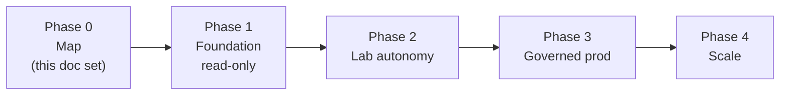

# Roadmap — From Architecture to a Governed Production Team

The architecture in [`ARCHITECTURE.md`](ARCHITECTURE.md) is the destination. This is
the order to build it in. The guiding rule: **earn write access; never assume it.**
Every phase ends read-only or lab-only until governance is proven.

---

## Phase 0 — Map the architecture ✅ *(you are here)*

The target architecture, agent roster, and governance model — this `docs/` set.
**Exit criteria:** operator signs off on the architecture and the agent boundaries.

---

## Phase 1 — Foundation & read-only agents

Stand up the substrate and the agents that can't hurt anything.

- **Layer 0/1:** Container runtime on the Dell servers; LLM egress gateway; Vault;
  confirm NetBox is the SoT and OOB reachability to the fleet.
- **Build the read-only MCP servers first:** NetBox (read), Observability (read),
  Validation (Batfish/CIS), Audit-trail reader.
- **Ship the safe agents:** **Compliance**, **Audit**, **Risk** — all read-only,
  all Tier 4. They start producing drift reports, compliance findings, and risk
  scores immediately, with zero blast radius.
- **Stand up the audit trail** before anything else writes.

**Exit criteria:** Compliance/Audit/Risk running unattended; audit trail capturing
their activity; drift between NetBox and the live fleet is visible.

> Value on day one without a single write to a device.

---

## Phase 2 — Lab autonomy & the config pipeline

Give the *building* agents a safe place to act.

- **Build the digital twin** (Batfish model / containerlab) as the lab environment.
- **Wrap the existing engine:** turn `netbox-nornir-graphql-webinar` into the
  **Exec MCP** and bring up the **Design/Config** and **Automation** agents.
- Config & Automation run at **Tier 3 in the lab only** — render, push, post-check,
  rollback, all against the twin.
- **Wire the Lead agent** to orchestrate the design→validate loop.
- **Stand up Change Mgmt** (ITSM integration, change records, the token mechanism)
  and the **Git/PR** flow — exercised end-to-end in the lab.

**Exit criteria:** an operator intent flows Lead → Config → Validation → (lab) Exec
→ Audit automatically against the twin; the full change loop works without touching
production.

---

## Phase 3 — Governed production

Open the production gate — carefully, behind every control in `GOVERNANCE.md`.

- Complete the **guardrails checklist** in `GOVERNANCE.md` §7.
- Production agents pinned **≤ Tier 2** (propose-only); humans hold every prod gate.
- Enable **commit-confirm + auto-rollback** on the production Exec path.
- Bring up the **Firewall/Security** agent (and the `Firewall-Analyser` surface) for
  ruleset analysis and security change proposals.
- Run the first **shadow changes**: agents propose, validate, and prepare real prod
  changes that a human approves and the system executes under full audit.

**Exit criteria:** a real production change has flowed through the full path —
proposed by an agent, validated, risk-scored, human-approved, executed with
rollback, evidenced in the audit trail — and reconciled back into NetBox.

---

## Phase 4 — Scale & harden

- Multi-site / multi-tenant scale-out.
- Broaden device-family coverage in the Exec MCP (NETCONF/gNMI per platform).
- Tune autonomy: graduate well-proven, low-risk change classes toward faster paths
  while keeping high-risk changes firmly gated.
- Feed incident/postmortem history into RAG so the team reasons from its own track
  record.

---

## Sequencing principles

1. **Read-only before read-write.** Compliance/Audit/Risk deliver value with zero risk.
2. **Lab before prod.** Nothing writes to production until it's been proven on the twin.
3. **Governance before autonomy.** The guardrails exist before the agent that needs them.
4. **Reuse what works.** The NetBox+Nornir+GraphQL engine and the Firewall-Analyser
   app are wrapped, not rewritten.
